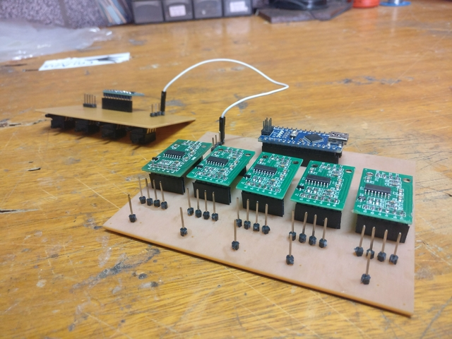
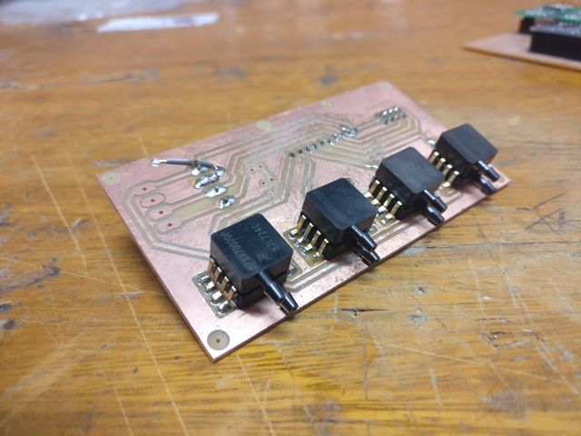
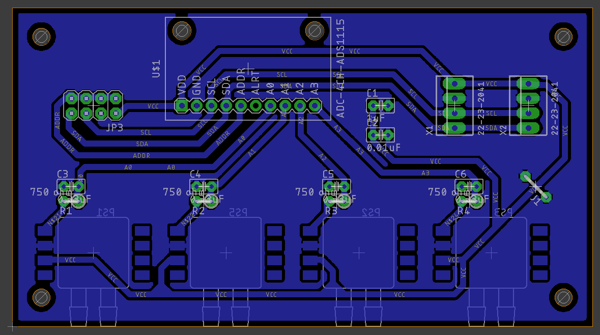
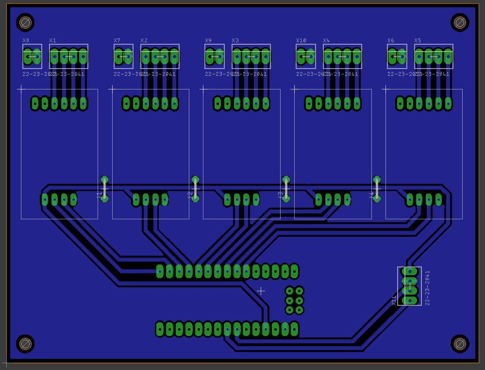

# Placas-Bancada-Mitica

The *Bancada Mitica 2.0* eletronics use the concept of [Sensor Hubs](https://en.wikipedia.org/wiki/Sensor_hub), where there's one or more boards (called Sources) responsible for adquiring data from sensors, and there's one central board (called Sink) responsible for receiving data from Sources, processing and forwarding it.

This repository contains the schematic, board and gerber files for the boards used in the *Bancada Mitica 2.0* project.

Those Source boards currently include Load Cells (through HX711) and Pitots (through MPXV7002DP and ADS1115).

All boards were designed in Eagle 9 and exported for fabrication with Eagle 6.

*Connected PCBs*

*Pitot PCB*

*Pitot board project*

*LoadCell board project*

